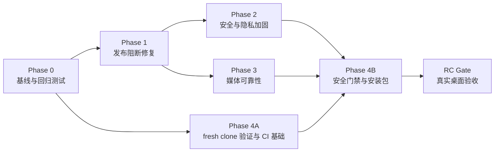

# 13 发布加固与可交付闭环迭代

## 目标

把当前“核心功能完成、以 mock 和开发态构建为主要证据”的版本，收口为可在目标 Apple Silicon macOS 设备上重复构建、安装和验收的内部 Release Candidate（RC）。

本迭代不新增业务功能。所有工作围绕四个结果展开：

1. 消除真实桌面音频链路和用户数据保护的发布阻断项。
2. 收紧密钥、外部服务 endpoint、Tauri WebView 和本地文件权限边界。
3. 为媒体处理建立资源上限、超时、持久化和清理策略。
4. 建立可在新克隆环境重复执行的 CI、打包、审计和真实服务验收门槛。

## 迭代启动基线（历史）

基线日期：2026-07-10。

- `main` 与 `origin/main` 同步，当前版本为 `0.1.0`。
- `pnpm typecheck`、30 个前端测试、前端生产构建、48 个 Rust 测试、`cargo fmt --check` 和 `cargo clippy -D warnings` 已通过。
- MVP 1~4 功能与 MVP 5 架构改进已完成；教师案例库 RAG Phase 1~4 已完成。
- 真实 Azure 30 秒以上长音频桌面流程、真实智谱 1024 维基准和安装包 smoke test 尚未形成发布证据。
- 当前没有 CI、签名/公证流程、Tauri E2E 或安装包发布记录。

因此，本迭代开始时的发布判定为 **No-Go**。只有“退出标准”全部满足后才能改为 RC。

## 不做什么

- 不新增评分维度、训练计划、云同步、账号或多人协作能力。
- 不做 Mac App Store 上架、自动更新或 Intel Mac 适配。
- 不在本迭代迁移 `sqlite-vec`，也不扩展教师案例库业务范围。
- 不把真实 API Key、学生音频、教师案例或本地路径提交到仓库或 CI。
- 不为了赶进度跳过 P0/P1 门槛；未通过的项目必须明确记录为 blocker，不能继续标记 deferred 后发布。

## 关键决策

### 1. Endpoint 与凭据绑定

- DeepSeek 和智谱继续支持第三方兼容 endpoint，这是现有产品要求。
- endpoint 必须由结构化 URL API 解析和规范化；禁止 userinfo、query、fragment，默认只允许 HTTPS。
- `http://localhost`、`http://127.0.0.1` 和 `http://[::1]` 只作为显式本地模式例外，不允许其他明文 HTTP 或私网地址隐式通过。
- 已保存 Key 必须绑定到规范化 origin。origin 改变且用户未重新输入 Key 时，清除对应 Key 并要求重新配置。
- 旧配置迁移时，将已有 Key 绑定到其当前已保存的规范化 origin；无法安全解析时不使用该 Key。
- Azure region 不作为 URL 片段自由输入，先按 Azure region grammar 校验，再由 URL API 构造并断言最终 host。

这样既保留第三方中转和本地 Ollama 类场景，又避免旧 Key 被静默发送到新地址。

### 2. macOS 媒体转换基线

- 内部 RC 的确定性基线使用系统绝对路径 `/usr/bin/afconvert`，因为当前产品只面向 Apple Silicon macOS，且既有 MP4、MP3、M4A、WAV 样本已验证该路径。
- 发布构建不得从当前工作目录或任意 `PATH` 位置执行同名转换器。
- 如果 clean-machine 验收证明 `afconvert` 无法覆盖承诺格式，再引入固定版本、固定 SHA-256、目标三元组明确的 Tauri `externalBin` FFmpeg sidecar；同时补齐许可证与 NOTICE。未满足这些条件的 FFmpeg 不进入发布路径。

### 3. 历史记录与音频所有权

- 每条媒体批改记录必须持有自己的 `audioPath`；文本记录没有音频路径。
- 播放器只能读取当前选中记录的音频，绝不回退到“最近一次转码结果”。
- 需要长期回听的 WAV 存入应用数据目录的受控子目录，不依赖可能被系统清理的 cache。
- 删除记录时仅通过受限 Rust command 删除该记录拥有的生成文件；命令必须验证目标位于受控目录内。
- 旧记录没有 `audioPath` 时显示“历史音频不可用”，不得猜测或复用其他文件。

### 4. 发布质量门槛

- `pnpm verify` 只包含新克隆可运行的静态检查、测试和构建，不依赖被忽略的本地媒体或 Key。
- 真实 Azure、智谱和安装包验收使用独立、显式的本地命令与记录模板。
- CI 不接入真实外部服务，不持有真实 Key；外部服务验收只在目标设备本地执行并保存脱敏结果。

## 执行阶段

执行规则：RH-401/RH-402 可在 Phase 0 后提前建立验证与 CI 基础；Phase 1 未全部完成前不开始真实服务验收；Phase 2 和 Phase 3 可并行；所有阶段完成后才能进入 RC Gate。

## 风险追踪

| 风险 | 主要证据位置 | 处理任务 | 关闭条件 |
| --- | --- | --- | --- |
| `convertFileSrc` 无 asset protocol | `src/lib/speech.ts`、`src/components/workspace/Workspace.tsx`、`src-tauri/tauri.conf.json` | RH-001、RH-101 | 打包后的 WAV 可读、可播放、可提交 Azure，scope 仅覆盖受控目录 |
| Azure region 或 Base URL 导流 Key | `src-tauri/src/speech.rs`、`src-tauri/src/config.rs`、`src-tauri/src/grading.rs`、`src-tauri/src/corpus.rs` | RH-001、RH-102 | 恶意输入测试通过，换 origin 强制重新输入 Key |
| 文本批改失败清空输入 | `src/hooks/useGradingWorkflow.ts`、`src/components/workspace/Workspace.tsx` | RH-001、RH-103 | 失败保留全部编辑内容，成功后才清空 |
| 历史报告与最近 WAV 错配 | `src/app/workspaceTypes.ts`、`src/hooks/useSessionHistory.ts`、`src/components/workspace/Workspace.tsx` | RH-001、RH-104、RH-303 | 每条记录独立持有文件，旧数据明确降级，删除联动安全 |
| CSP、command 权限和明文 Key | `src-tauri/tauri.conf.json`、`src-tauri/src/lib.rs`、`src-tauri/src/config.rs` | RH-201、RH-202、RH-203 | CSP/capability 生效，Keychain 迁移完成，错误不泄露上游 body |
| Speech SDK 生产依赖漏洞 | `package.json`、`pnpm-lock.yaml` | RH-002、RH-205、RH-403 | 生产审计无未处置 high/critical，CI 能持续阻断回归 |
| 媒体无资源上限、超时和清理 | `src-tauri/src/media.rs`、`src/lib/speech.ts` | RH-301~RH-304 | 超限、超时、取消和清理均有自动化及桌面验收 |
| 验证脚本依赖被忽略素材、无 CI/安装包证据 | `scripts/verify-mvp4-readiness.mjs`、`.gitignore`、`package.json` | RH-401~RH-406 | fresh clone CI、`.app` smoke、真实服务和 Go/No-Go 记录齐全 |

证据位置只用于快速定位，实际实现前仍须通过 CodeGraph 重新分析调用链和影响范围。

## 任务拆分

状态枚举：`planned`、`in_progress`、`blocked`、`done`。P0/P1 都是内部 RC 的阻断任务，优先级只表示执行顺序，不表示 P1 可以延期。任务完成时必须同时填写实现提交和验收证据，不能只修改状态文本。

### Phase 0：基线与失败用例

| 编号 | 优先级 | 任务 | 依赖 | 预估 | 状态 | 完成证据 |
| --- | --- | --- | --- | --- | --- | --- |
| RH-001 | P0 | 为 asset protocol 配置、文本批改失败保留输入、历史音频隔离、endpoint 校验补充会先失败的回归测试 | 无 | 1 天 | planned | 测试能分别复现 4 类问题，修复前失败、修复后通过 |
| RH-002 | P0 | 记录当前构建、测试、依赖审计和 Tauri 环境基线；将结果写入本文件“迭代记录” | 无 | 0.5 天 | planned | 基线命令、版本、测试数量和已知漏洞均有脱敏记录 |

### Phase 1：发布阻断修复

| 编号 | 优先级 | 任务 | 依赖 | 预估 | 状态 | 完成证据 |
| --- | --- | --- | --- | --- | --- | --- |
| RH-101 | P0 | 建立 `$APPDATA/generated-media` 受控目录并将新生成 WAV 写入其中；在 Tauri 配置启用 asset protocol 且 scope 仅覆盖该目录 | RH-001 | 0.5 天 | planned | 配置 schema 检查、自动化断言和打包后读取/播放 smoke test 通过 |
| RH-102 | P0 | 实现 Azure region 严格校验，以及 DeepSeek/智谱 URL 规范化、HTTPS/本地模式策略和 Key-origin 绑定迁移 | RH-001 | 2 天 | planned | Rust 单测覆盖恶意 region、userinfo、fragment、HTTP、loopback、换 origin 清 Key和旧配置迁移 |
| RH-103 | P0 | 让文本批改提交显式返回成功/失败；只在成功创建历史记录后清空输入、标题和题目 | RH-001 | 0.5 天 | planned | DeepSeek/RAG 失败时输入保留，成功时按产品行为清空；前端回归测试通过 |
| RH-104 | P0 | 给媒体历史记录增加独立 `audioPath`，切换记录时只绑定当前记录；迁移旧 localStorage 记录 | RH-001 | 1 天 | planned | 两条记录来回切换不会音频错配；旧记录显示音频不可用；重启恢复正确 |

### Phase 2：安全、密钥与隐私

| 编号 | 优先级 | 任务 | 依赖 | 预估 | 状态 | 完成证据 |
| --- | --- | --- | --- | --- | --- | --- |
| RH-201 | P1 | 配置最小 CSP；为自定义 Tauri commands 建立 manifest/capability，限制可调用窗口和命令集合 | RH-101、RH-102 | 1.5 天 | planned | CSP 下应用正常；未授权窗口不能调用敏感 command；无 `csp: null` |
| RH-202 | P1 | 将三类 API Key 迁移到 macOS Keychain；非密钥配置采用 `0600`、临时文件 + `fsync` + 原子 rename | RH-102 | 2 天 | planned | 旧明文配置迁移成功后不再含 Key；权限、损坏恢复、保存/清除测试通过 |
| RH-203 | P1 | 统一上游错误脱敏：生产错误仅保留 code、status、request ID；禁止持久化原始响应 body | RH-102 | 1 天 | planned | Key、Authorization、query、学生文本不会出现在 UI、日志或 `embedding_error` |
| RH-204 | P1 | 在首次使用和设置页说明三条云端数据流，并提供按服务启用/停用与本地数据保留说明 | RH-203 | 1 天 | planned | 用户能在提交前知道哪些数据发往 DeepSeek、智谱和 Azure；禁用后不发请求 |
| RH-205 | P1 | 修复生产依赖审计项并升级安全补丁；评估 Speech SDK override 兼容性，增加 Rust 依赖审计 | RH-002 | 1 天 | planned | `pnpm audit --prod` 无 high/critical；Rust 审计无未处置 high/critical；Azure 回归通过 |

### Phase 3：媒体可靠性与生命周期

| 编号 | 优先级 | 任务 | 依赖 | 预估 | 状态 | 完成证据 |
| --- | --- | --- | --- | --- | --- | --- |
| RH-301 | P1 | 将发布路径固定为 `/usr/bin/afconvert`；移除生产环境 cwd/PATH 回退；完成 clean-machine 格式兼容验证 | RH-002 | 1 天 | planned | MP4、MP3、M4A、WAV 在目标机转为 16kHz/16bit/mono；不会执行伪造 PATH 二进制 |
| RH-302 | P1 | 增加输入大小/时长上限、受控子进程、超时/kill、有限 stderr 缓冲和取消状态 | RH-301 | 2 天 | planned | 超大、超时、损坏和用户取消均在限定时间内结束并显示明确错误 |
| RH-303 | P1 | 在 RH-101 受控目录上实现删除记录联动、孤儿文件清理、容量上限和失败回滚 | RH-104、RH-302 | 1.5 天 | planned | 文件所有权可追踪；删除不越权；失败不留孤儿；达到上限有明确行为 |
| RH-304 | P1 | 为 Azure continuous recognition 增加总超时、取消和 WAV 读取大小保护，避免无限 Promise 和整文件无界内存 | RH-101、RH-302 | 1 天 | planned | 空结果、SDK 不回调、超时和超限 WAV 都能回收 recognizer 并返回结构化错误 |

初始媒体限制采用可集中调整的常量：输入文件不超过 500 MB、音频时长不超过 30 分钟、单个生成 WAV 不超过 64 MB、转码不超过 10 分钟。真实样本证明不合理时可调整，但变更必须附资源测量和验收记录。

### Phase 4：可重复构建与发布门禁

| 编号 | 优先级 | 任务 | 依赖 | 预估 | 状态 | 完成证据 |
| --- | --- | --- | --- | --- | --- | --- |
| RH-401 | P1 | 拆分 `pnpm verify` 与本地真实素材验收；用仓库内生成的小型 WAV fixture 保障 fresh clone 可运行 | RH-001 | 1 天 | planned | 新目录克隆后无需 Key/私有素材即可执行完整 `pnpm verify` |
| RH-402 | P1 | 固定 Node、pnpm、Rust 版本，建立 CI：锁文件安装、typecheck、test、build、fmt、clippy、Rust test | RH-401 | 1.5 天 | planned | Pull Request CI 全绿，任一检查失败都会阻止合入 |
| RH-403 | P1 | 在 CI 加生产依赖审计、Rust advisories、secret scan，并为可接受例外建立带到期日的 allowlist | RH-205、RH-402 | 1 天 | planned | high/critical 或疑似密钥会阻止合入；例外包含负责人、原因和截止日期 |
| RH-404 | P1 | 配置应用图标和 `.app` bundle 构建；建立未签名内部 RC 的启动、配置、三套主题切换、文件协议和数据库迁移 smoke test | RH-201、RH-303、RH-402 | 1.5 天 | planned | clean build 产出 `.app`，目标机首次启动、主题切换与重启恢复、升级迁移和核心 smoke 全通过 |
| RH-405 | P1 | 执行真实服务验收：Azure 30 秒以上音频、DeepSeek 文本评分、智谱 1024 维 benchmark 与阈值预览 | RH-304、RH-404 | 1 天 | planned | 脱敏验收记录包含输入类型、耗时、状态和结果摘要，不包含 Key/Token/原文 |
| RH-406 | P1 | 完成发布文档：版本号、CHANGELOG、LICENSE/NOTICE、已知限制、备份/回滚步骤和 RC Go/No-Go 记录 | RH-403、RH-404、RH-405 | 1 天 | planned | 文档可指导另一台目标机完成安装、验收和回滚 |

RH-404 承接旧 R-404 的三套主题切换验收；RH-405 承接真实 Azure 桌面播放同步以及 CRI-207/CRI-405 的真实智谱 1024 维基准。两项完成时应回写第 00、06、07、08、09、11、12 章，不再保留重复的 deferred 状态。

## 建议排期

以下是单人串行实施的基线，合计约 24.5 个工程日，另预留 4 个工程日处理真实服务、打包和迁移中的不确定性。Phase 2 和 Phase 3 若有两个独立执行者，可在 Phase 1 后并行，整体可压缩到约 19 个工程日。

| 周次 | 目标 | 计划任务 | 阶段结果 |
| --- | --- | --- | --- |
| 第 1 周 | 固化回归并清除直接数据损失/桌面阻断 | RH-001、RH-002、RH-101~RH-104 | P0 代码阻断关闭，用户输入和历史音频行为正确 |
| 第 2 周 | 收紧 endpoint、WebView、密钥和错误边界 | RH-201~RH-205 | 安全边界可测试，供应链 high/critical 有处置结果 |
| 第 3 周 | 建立媒体上限、超时、取消和文件生命周期 | RH-301~RH-304、缓冲 1 天 | 超大/损坏/超时媒体不会拖垮应用，生成文件可追踪和清理 |
| 第 4 周 | 建立 fresh clone 验证、CI 与安全门禁 | RH-401~RH-403、RH-404 前半 | CI 可阻止回归，能稳定产出内部 `.app` |
| 第 5 周 | 完成桌面 smoke、真实服务和 RC 审查 | RH-404~RH-406、缓冲 3 天 | 验收证据、发布说明和 Go/No-Go 决策齐全 |

若 P0 修复发现必须调整核心数据模型或 Tauri 权限设计，先更新本文的依赖和排期，再继续实施；不得用并行开发掩盖未确定的基础契约。

## 测试矩阵

| 层级 | 必测内容 | 执行方式 | 阻断规则 |
| --- | --- | --- | --- |
| TypeScript | 类型、输入保留、历史迁移、记录与音频绑定、RAG 降级 | `pnpm typecheck`、`pnpm test` | 任一失败阻断 |
| Rust | URL/region、Key-origin、配置迁移、权限、媒体路径边界、超时和清理 | `cargo test --locked` | 任一失败阻断 |
| 静态质量 | Rust 格式与 warning、前端 lint/format | `cargo fmt --check`、`cargo clippy -D warnings`、新增前端质量命令 | 任一失败阻断 |
| 供应链 | 生产依赖、Rust advisory、secret scan | CI 安全 jobs | high/critical 或 secret 阻断 |
| 安装包 smoke | 启动、设置、三套主题切换、转码、asset protocol、历史恢复、案例库迁移 | 目标 macOS `.app` | 任一核心链路失败阻断 |
| 真实服务 | DeepSeek、Azure continuous mode、智谱 1024 维 | 本地显式验收命令 + UI 检查 | Azure/DeepSeek 失败阻断；智谱失败则 RAG 不得宣称完成 |

## RC 退出标准

以下条件必须全部满足：

- 本章任务表列出的 21 项 RH 任务全部为 `done`，且每项有实现提交和验收证据。
- asset protocol 仅开放受控生成媒体目录，打包后的播放与 Azure 读取成功。
- 恶意 Azure region 和非法 Base URL 被拒绝；换 origin 不会复用旧 Key。
- 文本批改失败不会丢输入；历史记录不会错配音频。
- Key 不再明文存储于普通配置文件，配置写入具备权限和原子性保证。
- 媒体转换、Azure 识别和本地缓存都有上限、超时、取消和清理路径。
- fresh clone 的 `pnpm verify` 通过，CI 主分支门禁生效。
- 生产依赖和 Rust advisory 中没有未处置的 high/critical；仓库 secret scan 通过。
- `.app` 在目标 Apple Silicon macOS 设备完成首次启动、重启、旧数据迁移和核心流程 smoke test。
- 真实 DeepSeek、Azure 长音频、智谱 1024 维验收完成并留下脱敏记录。
- Go/No-Go 审查结论、已知限制和回滚方式已写入本文件。

任何一项不满足，发布结论保持 **No-Go**。

## 建议提交顺序

每个编号使用独立提交，避免把安全策略、数据迁移和 UI 行为混在同一变更中：

1. `test: add release blocker regression coverage`（RH-001）
2. `fix: enable scoped generated media access`（RH-101）
3. `fix: validate service endpoints and bind credentials`（RH-102）
4. `fix: preserve failed grading input`（RH-103）
5. `fix: bind history records to owned audio`（RH-104）
6. Phase 2 安全提交，按 RH-201~RH-205 顺序。
7. Phase 3 媒体提交，按 RH-301~RH-304 顺序。
8. Phase 4 交付提交，按 RH-401~RH-406 顺序。

每个实现提交前后至少运行与改动直接相关的测试；阶段结束时运行完整 `pnpm verify`。涉及配置格式或历史数据结构的提交必须同时带迁移测试。

## 迭代记录

| 日期 | 任务 | 状态 | 提交 | 验收摘要 | 阻塞项 |
| --- | --- | --- | --- | --- | --- |
| 2026-07-10 | 迭代计划建立 | done | 文档变更 | 已完成风险分级、依赖排序和 RC 退出标准 | 无 |

## Go/No-Go 记录

| 日期 | 版本 | 结论 | 未完成门槛 | 审查说明 |
| --- | --- | --- | --- | --- |
| 2026-07-10 | 0.1.0 | No-Go | 本章列出的 21 项 RH 任务 | 核心功能存在真实桌面、安全和发布工程缺口，进入发布加固迭代 |

## 后续扩展

以下内容不阻塞内部 RC，但必须在公开分发前重新评估：

- Developer ID 签名、公证、DMG 和自动更新。
- FFmpeg sidecar 的固定版本分发、SBOM 与许可证合规。
- 更完整的 WebView/Tauri 自动化 E2E。
- Keychain 跨平台实现和数据导出/删除工具。
- 性能趋势、崩溃报告和长期缓存观测。
