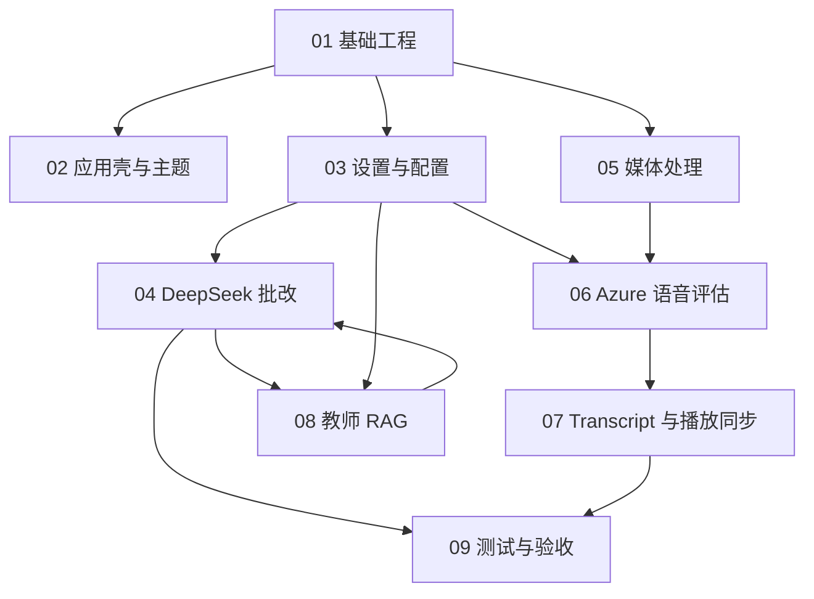

# 开发文档索引

## 目标

本目录用于承接 `DEVELOPMENT_PLAN.md` 的细颗粒度开发计划。每份文档对应一个功能模块，任务拆分控制在 1-2 天可完成、可验收的范围。

## 当前状态

- MVP 1 基础工程、设置、主题、DeepSeek 文本批改链路已进入收口阶段。
- DeepSeek 已接入 `deepseek-v4-flash` 和 `deepseek-v4-pro`，默认使用 `deepseek-v4-flash`。
- 设置页已提供 DeepSeek `/models` 连通性测试，展示 `availableModels` 和当前模型可用状态。
- MVP 2 媒体导入与转码已完成基础链路。
- MVP 3 已代码收口：接入 Azure Speech SDK continuous mode 长音频发音评估、逐词 transcript、停顿标注、低分词标注、点击跳转和播放高亮。
- MVP 4 教师 RAG 仍在后续范围。
- 当前自动化验证记录：`pnpm typecheck`、`pnpm test`、`pnpm build`、`cd src-tauri && cargo test` 均通过。
- 当前 deferred 人工验收：配置真实 Azure Speech Key 后，用 30 秒以上 WAV 验证 continuous pronunciation assessment。

## 推荐阅读顺序

1. [00-roadmap.md](00-roadmap.md)
2. [01-project-foundation.md](01-project-foundation.md)
3. [02-app-shell-theme.md](02-app-shell-theme.md)
4. [03-settings-config.md](03-settings-config.md)
5. [04-deepseek-grading.md](04-deepseek-grading.md)
6. [05-media-processing.md](05-media-processing.md)
7. [06-azure-speech-assessment.md](06-azure-speech-assessment.md)
8. [07-transcript-playback-sync.md](07-transcript-playback-sync.md)
9. [08-teacher-rag.md](08-teacher-rag.md)
10. [09-testing-acceptance.md](09-testing-acceptance.md)

## 模块依赖

## 文档模板

每份功能文档应包含：

- 目标
- 不做什么
- 用户流程
- 技术设计
- 数据结构
- 任务拆分
- 验收标准
- 测试建议
- 风险与后续扩展

## 执行原则

- 先保证单机个人使用链路稳定，再扩展复杂能力。
- 外部服务统一由 Rust 后端命令层调用。
- 前端只处理交互、展示和本地状态，不直接持有敏感密钥。
- Azure Speech 例外：Rust 后端只签发短期 token，前端 SDK 使用 token 做 continuous recognition，仍不持有 Azure Key。
- 任何功能都必须有明确失败状态。
- 不批量删除文件或目录。

## 测试资源目录

- `test-resource/` 是本项目约定的本地测试资源目录，用于放置人工验收或本地调试用的媒体样本、压缩包和临时输入文件。
- `test-resource/` 不属于产品运行数据，也不属于发布资产。
- `test-resource/` 已加入 `.gitignore`，默认不提交到仓库。
- 开发文档、测试记录或人工验收说明可以引用该目录中的样本用途，但不要提交大体积或版权不明的测试媒体文件。
