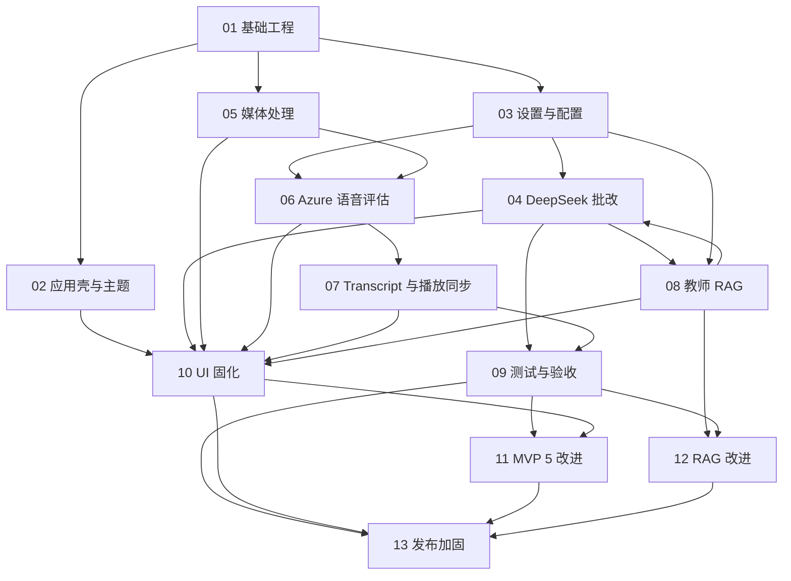

# 开发文档索引

## 目标

本文件是项目文档的统一导航入口。`docs/development/` 同时承接功能模块设计、跨模块改进计划、测试证据和发布迭代；任务原则上拆分到 0.5-2 个工程日，并具备明确依赖、状态和验收证据。

## 项目级文档

| 文档 | 职责 | 何时阅读 |
| --- | --- | --- |
| [项目 README](../../README.md) | 项目简介、当前进展、本地运行和安全约束 | 初次进入项目时 |
| [产品需求文档](../../PRD-ielts-speaking-test-copilot.md) | 产品定位、用户价值、首版范围和原始约束 | 判断需求是否在产品范围内时 |
| [开发总纲](../../DEVELOPMENT_PLAN.md) | 技术栈、MVP 路线、全局接口和工程约束 | 设计跨模块实现方案时 |
| [开发文档索引](README.md) | 当前阶段、文档地图、依赖关系和状态回写规则 | 每次开始或结束开发任务时 |
| [仓库开发指南](../../CLAUDE.md) | 常用命令、目录结构和代码约定 | 执行本地开发与验证时 |

## 当前状态

- MVP 1~4 的计划内代码范围已完成并通过现有自动化验证；真实桌面与发布验收仍由第 13 章承接，不代表当前已达到 RC。
- MVP 5 稳定化原任务 R-401~R-403、R-405~R-406 已完成；R-404 已拆分并入第 13 章 RH-404/RH-405，作为 RC 验收门槛。
- MVP 5 附加改进任务 R-501~R-508 已完成，详见 [11-mvp5-improvements.md](11-mvp5-improvements.md)。
- 第 12 章教师案例库 RAG 改进 Phase 1~4 已完成：`rusqlite` bundled 存储层、f32 BLOB 向量、配置化阈值、query embedding cache、自动 Embedding、RAG 引用展示、诊断搜索预览、pending/failed 队列重建和本地 benchmark 脚本均已落地；真实智谱 1024 维基准由第 13 章 RH-405 承接，作为 RC 验收门槛。
- 第 13 章发布加固迭代已建立，当前发布结论为 No-Go；在 asset protocol、endpoint/密钥边界、用户输入与历史音频、媒体资源治理、CI、安装包和真实服务验收全部闭环后才进入 RC。
- 当前自动化验证记录：`pnpm typecheck`、`pnpm test`、`pnpm build`、`cd src-tauri && cargo test` 均通过；Rust 测试不再要求 `--test-threads=1`。
- 当前真实服务 CLI 预检：使用本地测试资源验证 Azure Speech token/WAV 样本和 DeepSeek `/models`、JSON mode，输出未包含 API Key 或短期 token。
- 当前待执行人工验收：按第 13 章 RH-405 在 Tauri 桌面 UI 使用真实 Azure Speech Key 和 30 秒以上 WAV 验证 continuous pronunciation assessment、点击跳转和播放高亮。
- UI 固化文档：[10-assessor-ui-redesign.md](10-assessor-ui-redesign.md)。UI 规范以当前代码实现为准，后续 UI 改动需同步更新该文档。

## 当前快速入口

| 目的 | 入口 |
| --- | --- |
| 执行当前迭代 | [13 发布加固与可交付闭环](13-release-hardening.md) |
| 查看里程碑与发布判定 | [00 Roadmap 与里程碑](00-roadmap.md) |
| 查看测试矩阵和历史验收证据 | [09 测试与验收](09-testing-acceptance.md) |
| 修改工作台 UI | [10 UI 固化：Assessor 工作台](10-assessor-ui-redesign.md) |
| 修改教师案例库或 RAG | [08 教师个性化 RAG](08-teacher-rag.md) 与 [12 RAG 改进计划](12-corpus-rag-improvements.md) |
| 修改配置、Key 或外部服务 endpoint | [03 设置与本地配置](03-settings-config.md) 与 [13 发布加固](13-release-hardening.md) |
| 修改媒体、Azure 或播放同步 | [05 媒体处理](05-media-processing.md)、[06 Azure 语音评估](06-azure-speech-assessment.md)、[07 播放同步](07-transcript-playback-sync.md) |

## 推荐阅读顺序

1. [00-roadmap.md](00-roadmap.md)
2. [01-project-foundation.md](01-project-foundation.md)
3. [02-app-shell-theme.md](02-app-shell-theme.md)
4. [03-settings-config.md](03-settings-config.md)
5. [04-deepseek-grading.md](04-deepseek-grading.md)
6. [05-media-processing.md](05-media-processing.md)
7. [06-azure-speech-assessment.md](06-azure-speech-assessment.md)
8. [07-transcript-playback-sync.md](07-transcript-playback-sync.md)
9. [08-teacher-rag.md](08-teacher-rag.md)
10. [09-testing-acceptance.md](09-testing-acceptance.md)
11. [10-assessor-ui-redesign.md](10-assessor-ui-redesign.md)
12. [11-mvp5-improvements.md](11-mvp5-improvements.md)
13. [12-corpus-rag-improvements.md](12-corpus-rag-improvements.md)
14. [13-release-hardening.md](13-release-hardening.md)

## 开发文档地图

| 编号 | 文档 | 职责边界 | 当前状态 |
| --- | --- | --- | --- |
| 00 | [Roadmap 与里程碑](00-roadmap.md) | 汇总阶段目标、任务状态和发布门槛，不替代详细设计 | 持续维护；当前指向 Release Hardening |
| 01 | [基础工程](01-project-foundation.md) | Tauri、React、TypeScript、Tailwind 基础与目录约定 | MVP 1 已完成 |
| 02 | [应用壳与主题系统](02-app-shell-theme.md) | 应用壳、导航、主题和基础交互 | MVP 1 已完成 |
| 03 | [设置与本地配置](03-settings-config.md) | 配置模型、保存/清除、Key 边界和连接测试 | 功能完成；安全加固由 RH-102/RH-202 承接 |
| 04 | [DeepSeek 批改生成](04-deepseek-grading.md) | Prompt、请求、JSON 解析、Schema 和评分错误 | 功能完成；endpoint/脱敏由 RH-102/RH-203 承接 |
| 05 | [媒体处理](05-media-processing.md) | 文件导入、转换器选择、WAV 输出与媒体错误 | 功能完成；发布可靠性由 RH-301~RH-303 承接 |
| 06 | [Azure 语音评估](06-azure-speech-assessment.md) | Token、continuous assessment、响应映射与真实服务边界 | 代码完成；桌面验收由 RH-304/RH-405 承接 |
| 07 | [Transcript 与播放同步](07-transcript-playback-sync.md) | token、停顿、点击跳转、当前词高亮和播放器行为 | 代码完成；历史音频修复由 RH-104 承接 |
| 08 | [教师个性化 RAG](08-teacher-rag.md) | 案例数据、Embedding、检索和 Prompt 注入 | MVP 4 已完成 |
| 09 | [测试与验收](09-testing-acceptance.md) | 全局测试矩阵、自动化结果和人工验收事实记录 | 持续维护；RC 证据完成后回写 |
| 10 | [UI 固化：Assessor 工作台](10-assessor-ui-redesign.md) | 当前 UI 事实源和交互规范 | 持续维护 |
| 11 | [MVP 5 附加改进](11-mvp5-improvements.md) | Hooks/组件拆分、Rust 模块化和构建优化 | R-501~R-508 已完成，作为历史迭代保留 |
| 12 | [教师案例库 RAG 改进](12-corpus-rag-improvements.md) | RAG 存储可靠性、检索质量、可观测性和维护队列 | Phase 1~4 已完成；真实基准转入 RH-405 |
| 13 | [发布加固与可交付闭环](13-release-hardening.md) | 安全、媒体生命周期、CI、安装包和真实服务 RC 门槛 | 当前迭代；No-Go，21 项 RH 任务 planned |

## 模块依赖

图中 11、12 是已完成的改进迭代，13 是当前跨模块发布迭代；箭头表示设计或验收依赖，不表示运行时调用关系。

## 文档模板

每份功能文档应包含：

- 目标
- 不做什么
- 用户流程
- 技术设计
- 数据结构
- 任务拆分
- 验收标准
- 测试建议
- 风险与后续扩展

## 执行原则

- 先保证单机个人使用链路稳定，再扩展复杂能力。
- 外部服务统一由 Rust 后端命令层调用。
- 前端只处理交互、展示和本地状态，不直接持有敏感密钥。
- Azure Speech 例外：Rust 后端只签发短期 token，前端 SDK 使用 token 做 continuous recognition，仍不持有 Azure Key。
- 任何功能都必须有明确失败状态。
- 不批量删除文件或目录。
- UI 设计冲突时以当前代码实现为准，并同步更新 `10-assessor-ui-redesign.md`。

## 状态回写规则

- 开始任务前：从本索引确认当前迭代，再在对应详细文档把任务改为 `in_progress`。
- 实现完成后：先在详细文档记录提交、测试与人工验收证据，证据不完整时不得标记 `done`。
- 功能事实变化：同步更新对应的 01-10 号模块文档；不得只更新迭代计划。
- 测试或验收事实变化：同步更新 [09-testing-acceptance.md](09-testing-acceptance.md)。
- 阶段或发布结论变化：同步更新 [00-roadmap.md](00-roadmap.md)、本索引、根 [README](../../README.md) 和 [开发总纲](../../DEVELOPMENT_PLAN.md)。
- RH-404/RH-405 完成时：共同关闭旧 R-404，并由 RH-405 关闭 CRI-207/CRI-405；回写 00、06、07、08、09、11、12、13 号文档，避免重复保留 deferred 状态。
- 文档与实现不一致时：以可验证的当前代码和最新验收证据为准，随后在同一任务内修正文档漂移。

## 测试资源目录

- `test-resource/` 是本项目约定的本地测试资源目录，用于放置人工验收或本地调试用的媒体样本、压缩包和临时输入文件。
- `test-resource/` 不属于产品运行数据，也不属于发布资产。
- `test-resource/` 已加入 `.gitignore`，默认不提交到仓库。
- 开发文档、测试记录或人工验收说明可以引用该目录中的样本用途，但不要提交大体积或版权不明的测试媒体文件。
